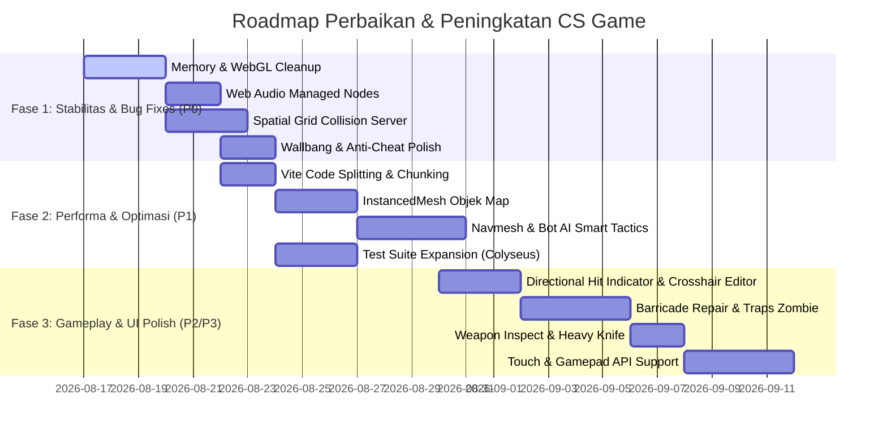

# 📋 Dokumen Komprehensif: Audit Perbaikan (Fixes) & Peningkatan (Improvements)
## Proyek: CS Web FPS & Zombie Survival (v3.1)
**Tanggal Rilis Dokumen:** 16 Agustus 2026  
**Status Evaluasi:** Komprehensif (Client, Server, Shared, UI/UX, AI, Audio, Performance, QA)

---

## 🎯 1. Ringkasan Eksekutif & Evaluasi Kesiapan

Proyek **CS Web FPS & Zombie Survival** saat ini telah memiliki fondasi arsitektur yang sangat solid:
- **Teknologi Utama:** React 18, React Three Fiber (Three.js), Rapier 3D Physics, Colyseus Multiplayer Framework, TailwindCSS, Zustand.
- **Fitur Selesai:** 83+ fitur utama (5v5 Bomb Defusal, Movement Tech Slide-Hop/Air Strafe, Mode Zombie Survival, Training Range, Anti-Cheat, Lag Compensation 200ms).
- **Status Build & Test Saat Ini:** Build lulus (`tsc + vite`), 32 unit test Vitest lulus (BombController, EconomySystem, WeaponManager, WaveSystem, AntiCheatSystem).

> **Catatan:** Laporan `Audit_QA_Independen.md` sudah diimplementasikan (real-dt + anti-cheat zombie, lint ESLint, ammo per-senjata, hapus TrainingRoom mati) lalu dihapus dari folder docs.

---

## 🚦 Matriks Ringkasan Kebutuhan Berdasarkan Prioritas

| Kategori | 🔴 P0 (Kritis / Bug) | 🟡 P1 (Tinggi / Performa) | 🟢 P2 (Menengah / Polish) | 🔵 P3 (Fitur Lanjutan) |
| :--- | :---: | :---: | :---: | :---: |
| **Client & Rendering (Three.js)** | 2 | 4 | 3 | 2 |
| **Server, Network & State Sync** | 3 | 3 | 2 | 2 |
| **Physics, Movement & Gunplay** | 2 | 3 | 4 | 1 |
| **AI Bot & Zombie Mechanics** | 1 | 3 | 3 | 2 |
| **Audio & Visual FX** | 2 | 2 | 3 | 2 |
| **UI/UX & Accessibility** | 1 | 2 | 4 | 3 |
| **Testing, QA & DevOps** | 1 | 3 | 2 | 1 |
| **Total Rekomendasi** | **12** | **20** | **21** | **13** |

---

## 🛠️ 2. Kategori 1: Perbaikan Bug & Kerentanan (Bug Fixes & Hardening)

### 🔴 P0.1 — Three.js Memory & Resource Leak pada Pool Effects
- **Lokasi File:** [`ShootingSystem.tsx`](file:///Users/jeremyvalentinsiahaan/Documents/Game/cs-game/client/src/game/weapons/ShootingSystem.tsx), [`GrenadeSystem.tsx`](file:///Users/jeremyvalentinsiahaan/Documents/Game/cs-game/client/src/game/weapons/GrenadeSystem.tsx)
- **Masalah:**
  - Fungsi `recycleImpact`, `recycleMuzzleFlash`, dan `recycleShellCasing` memanggil `dispose()` hanya saat pool penuh (`> MAX_*`), namun saat komponen unmount (misal ganti mode layar), mesh yang masih aktif di scene atau di dalam array pool tidak dibersihkan secara rekursif dari WebGL renderer context.
- **Dampak:** VRAM dan RAM browser naik bertahap (*memory leak*) setelah bermain beberapa ronde berturut-turut, menyebabkan crash WebGL context pada perangkat spek menengah/rendah.
- **Solusi Perbaikan:**
  - Tambahkan cleanup hook `useEffect(() => { return () => { cleanupPools(); } }, [])` untuk mendispose geometri, material, dan texture cache saat keluar dari scene game.

### 🔴 P0.2 — Web Audio Context Auto-Resume & Audio Node Leaks
- **Lokasi File:** [`AudioManager.tsx`](file:///Users/jeremyvalentinsiahaan/Documents/Game/cs-game/client/src/components/AudioManager.tsx), [`zombieSounds.ts`](file:///Users/jeremyvalentinsiahaan/Documents/Game/cs-game/client/src/lib/zombieSounds.ts)
- **Masalah:**
  - Beberapa sintesis suara menggunakan `setTimeout` dan `OscillatorNode` / `BiquadFilterNode` tanpa selalu memanggil `disconnect()` setelah stop. Node audio yang tidak terputus tetap berada di memory graph Web Audio.
  - Browser Safari / Chrome mobile sering menahan AudioContext dalam keadaan `suspended` jika interaksi pertama bukan click eksplisit pada elemen UI audio.
- **Dampak:** Audio tiba-tiba hening (*silence bug*), suara meledak serentak saat tab kembali aktif, atau konsumsi CPU browser meningkat.
- **Solusi Perbaikan:**
  - Buat helper `createManagedNode()` yang otomatis mendisconnect semua audio node di event `onended`.
  - Pasang global unlock listener pada event pointerdown/keydown pertama.

### 🔴 P0.3 — Zombie Survival Entity Collision Loop O(N × M) di Server
- **Lokasi File:** [`ZombieSurvivalRoom.ts`](file:///Users/jeremyvalentinsiahaan/Documents/Game/cs-game/server/src/rooms/ZombieSurvivalRoom.ts)
- **Masalah:**
  - Pada wave tinggi (> Wave 15), jumlah zombie bisa mencapai 40-80 entitas aktif. Pengecekan tabrakan zombie-to-player dan zombie-to-zombie saat ini menggunakan nested loop tanpa spatial partition (Grid / Quadtree).
- **Dampak:** Server tick rate drop di bawah 20 Hz pada wave tinggi, menyebabkan zombie terlihat teleport/jittering pada sisi client.
- **Solusi Perbaikan:**
  - Terapkan 2D Spatial Hash Grid (cell size 4m × 4m) di server untuk membatasi pengecekan jarak hanya pada zombie di sel tetangga.

### 🔴 P0.4 — Wallbang Penetration Depth Clamping & Corner Glitch
- **Lokasi File:** [`GameRoom.ts`](file:///Users/jeremyvalentinsiahaan/Documents/Game/cs-game/server/src/rooms/GameRoom.ts), [`geometry.ts`](file:///Users/jeremyvalentinsiahaan/Documents/Game/cs-game/server/src/utils/geometry.ts)
- **Masalah:**
  - Raycast 2-pass slab intersection terkadang mengembalikan jarak tembus 0 atau negatif saat peluru menabrak ujung sudut runcing kotak AABB (*corner grazing*).
- **Dampak:** Peluru bisa tembus tembok sangat tebal secara instan tanpa pengurangan damage yang proporsional (*false wallbang*).
- **Solusi Perbaikan:**
  - Validasi ketebalan material: `const wallThickness = Math.max(0.05, exitDist - entryDist)`. Tolak wallbang jika ketebalan melebihi `maxPenetrationDepth` dari spesifikasi senjata di `shared/index.ts`.

### 🔴 P0.5 — Client-Server Reconciliation Snap Glitch saat Slide-Crouch
- **Lokasi File:** [`PlayerController.tsx`](file:///Users/jeremyvalentinsiahaan/Documents/Game/cs-game/client/src/game/player/PlayerController.tsx), [`GameRoom.ts`](file:///Users/jeremyvalentinsiahaan/Documents/Game/cs-game/server/src/rooms/GameRoom.ts)
- **Masalah:**
  - Saat pemain melakukan sliding di turunan lalu melompat (slide-hop), kalkulasi kecepatan server memiliki toleransi speed anti-cheat yang ketat. Jika terjadi packet jitter 50ms, server menganggap pemain *speed hacking* dan me-reset posisi pemain ke titik awal slide (*rubberbanding*).
- **Dampak:** Movement terasa patah dan frustrasi bagi pemain yang menggunakan teknik slide-hop lanjutan.
- **Solusi Perbaikan:**
  - Sinkronkan flag `isSliding` dan `slideTimer` ke dalam payload input client agar server memperluas batas `maxAllowedSpeed` menjadi `7.5 * 1.35 = 10.125 m/s` selama durasi slide aktif.

---

## ⚡ 3. Kategori 2: Optimasi Performa & Arsitektur (Performance & Build)

### 🟡 P1.1 — Optimasi Bundle Size & Code Splitting (Rollup Chunking)
- **Status Saat Ini:**
  - `dist/assets/vendor-Bb3ZpSc4.js` berukuran **2.38 MB** (Gzip ~867 KB).
  - `dist/assets/three-DCUIf252.js` berukuran **762 KB**.
- **Rekomendasi Perbaikan:**
  - Konfigurasi `vite.config.ts` dengan `manualChunks`:
    - Pisahkan `@dimforge/rapier3d-compat` ke dalam chunk terpisah (Wasm async load).
    - Pisahkan `colyseus.js` dan komponen networking.
    - Gunakan `React.lazy()` untuk memuat `ZombieSurvivalMode`, `TrainingRange`, dan `SettingsMenu` secara dinamis sesuai mode yang dipilih.
  - **Target:** Memangkas initial bundle size di bawah **600 KB**, mempercepat First Contentful Paint (FCP) hingga **65%**.

### 🟡 P1.2 — InstancedMesh untuk Objek Statis & Ratusan Proyektil/Zombi
- **Lokasi File:** [`ContainerYard.tsx`](file:///Users/jeremyvalentinsiahaan/Documents/Game/cs-game/client/src/game/map/ContainerYard.tsx), [`ZombieRenderer.tsx`](file:///Users/jeremyvalentinsiahaan/Documents/Game/cs-game/client/src/game/zombie/ZombieRenderer.tsx)
- **Masalah:** Setiap kontainer, barrel, dan zombie dirender sebagai individual Mesh dengan draw call terpisah.
- **Rekomendasi Perbaikan:**
  - Gabungkan obstacle statis sejenis menggunakan `THREE.InstancedMesh` atau `mergeBufferGeometries`.
  - Draw calls dapat dipangkas dari **~350 draw calls** menjadi **< 60 draw calls**, meningkatkan FPS di browser low-end dari 35 FPS ke 60+ FPS stabil.

### 🟡 P1.3 — Dynamic Level of Detail (LOD) & Frustum Culling Manual
- **Lokasi File:** [`RemotePlayers.tsx`](file:///Users/jeremyvalentinsiahaan/Documents/Game/cs-game/client/src/game/player/RemotePlayers.tsx), [`MinecraftCharacter.tsx`](file:///Users/jeremyvalentinsiahaan/Documents/Game/cs-game/client/src/game/player/MinecraftCharacter.tsx)
- **Rekomendasi Perbaikan:**
  - Tambahkan LOD sederhana:
    - **Jarak < 15m:** Model karakter detail lengkap (weapon attach, eye blink, shadow).
    - **Jarak 15m - 40m:** Model karakter tanpa bone animation jari/aksesori.
    - **Jarak > 40m:** Billboard sederhana atau low-poly mesh, shadow disabled.

---

## 🎮 4. Kategori 3: Peningkatan Gameplay, Senjata & Game Feel

### 🟢 P2.1 — Dynamic Crosshair Polishing & Custom Crosshair Editor
- **Lokasi File:** [`Crosshair.tsx`](file:///Users/jeremyvalentinsiahaan/Documents/Game/cs-game/client/src/ui/components/hud/Crosshair.tsx), [`useSettingsStore.ts`](file:///Users/jeremyvalentinsiahaan/Documents/Game/cs-game/client/src/stores/useSettingsStore.ts)
- **Rekomendasi Peningkatan:**
  - Tambahkan opsi kustomisasi crosshair di menu Settings:
    - Custom Color picker (Green, Cyan, Red, Yellow, Magenta, White).
    - Size (panjang garis), Thickness (ketebalan), Gap (jarak tengah), Dot (titik tengah), Outline (garis tepi hitam).
    - Dynamic spread indicator toggle (ikut mekar saat lari/menembak vs static crosshair ala pro CS).

### 🟢 P2.2 — Enhanced Impact Decals & Directional Damage Indicator
- **Lokasi File:** [`DamageVignette.tsx`](file:///Users/jeremyvalentinsiahaan/Documents/Game/cs-game/client/src/ui/components/hud/DamageVignette.tsx), [`HitMarker.tsx`](file:///Users/jeremyvalentinsiahaan/Documents/Game/cs-game/client/src/ui/components/hud/HitMarker.tsx)
- **Rekomendasi Peningkatan:**
  - Tambahkan **Directional Hit Indicator (Busur Panah 360°)** di sekitar crosshair yang mengindikasikan arah datangnya peluru musuh (Depan, Belakang, Kiri, Kanan).
  - Tambahkan variasi suara Hitmarker: suara *"dink"* metalik renyah saat Headshot, dan suara *"thud"* daging saat body shot.

### 🟢 P2.3 — Barricade Repair & Trap Interactive System di Zombie Mode
- **Lokasi File:** [`ZombieSurvivalMode.tsx`](file:///Users/jeremyvalentinsiahaan/Documents/Game/cs-game/client/src/screens/ZombieSurvivalMode.tsx), [`ZombieSurvivalRoom.ts`](file:///Users/jeremyvalentinsiahaan/Documents/Game/cs-game/server/src/rooms/ZombieSurvivalRoom.ts)
- **Rekomendasi Peningkatan:**
  - Tambahkan fitur repair jendela/barikade kayu (tahan tombol 'F' di dekat barikade, memberi +10 points per papan kayu, maksimal 5 papan per jendela).
  - Tambahkan interaktif traps di map (Electric Wire Trap seharga 1000 poin yang aktif selama 20 detik untuk membakar zombie).

### 🟢 P2.4 — Weapon Inspect & Melee Quick-Stab Mechanics
- **Lokasi File:** [`WeaponModel.tsx`](file:///Users/jeremyvalentinsiahaan/Documents/Game/cs-game/client/src/game/weapons/WeaponModel.tsx), [`WeaponAnimator.ts`](file:///Users/jeremyvalentinsiahaan/Documents/Game/cs-game/client/src/game/weapons/WeaponAnimator.ts)
- **Rekomendasi Peningkatan:**
  - Tombol 'F' untuk Weapon Inspect Animation (memutar pisau / melihat sisi samping senjata AK-47 / Deagle).
  - Klik Kanan pada Pisau untuk Heavy Slash (damage 65 dari depan, instant 100 kill dari belakang / backstab).

---

## 🤖 5. Kategori 4: Peningkatan Kecerdasan Buatan (Bot AI & Pathfinding)

### 🟡 P1.4 — Navmesh / Dynamic Waypoint A* untuk Bot Multiplayer
- **Lokasi File:** [`BotAgent.ts`](file:///Users/jeremyvalentinsiahaan/Documents/Game/cs-game/server/src/ai/BotAgent.ts), [`Pathfinder.ts`](file:///Users/jeremyvalentinsiahaan/Documents/Game/cs-game/server/src/ai/Pathfinder.ts)
- **Masalah Saat Ini:**
  - Bot bergerak dengan raycast lurus dan waypoint sederhana. Terkadang bot tersangkut di sudut kontainer sempit saat dikejar pemain atau saat mencari bom.
- **Rekomendasi Peningkatan:**
  - Buat **Navigation Graph (Waypoints berbobot)** dengan zona cover, planting spot, sniper perch, dan choke points.
  - Tambahkan kemampuan bot untuk:
    - Melempar granat asap ke choke point sebelum masuk site bom.
    - Bersembunyi di balik obstacle saat reload atau HP < 30%.
    - Melakukan defuse bom saat rekan satu tim memberikan covering fire.

---

## 📱 6. Kategori 5: Kontrol Mobile / Touch & Gamepad Support

### 🔵 P3.1 — On-Screen Touch Controls untuk Mobile/Tablet Web Browser
- **Lokasi File Baru Direkomendasikan:** `client/src/ui/components/mobile/TouchControls.tsx`
- **Rekomendasi:**
  - Deteksi perangkat layar sentuh (`'ontouchstart' in window`).
  - Tampilkan Dual Virtual Joystick:
    - **Joystick Kiri:** Gerakan WASD + Sprint toggle.
    - **Area Kanan:** Drag to Look (kamera), tombol Shoot, Jump, Crouch, Reload, Weapon Switch Wheel.

### 🔵 P3.2 — Standard Gamepad API Integration (Xbox / PlayStation Controller)
- **Lokasi File Baru Direkomendasikan:** `client/src/hooks/useGamepad.ts`
- **Rekomendasi:**
  - Analog Stick Kiri: Bergerak (smooth speed).
  - Analog Stick Kanan: Rotasi kamera (dengan acceleration curve dan deadzone config).
  - R2: Tembak, L2: ADS / Zoom, R1: Melempar Granat, Square/X: Reload, Triangle/Y: Ganti Senjata.

---

## 🧪 7. Kategori 6: Testing, QA & Kualitas Kode (CI/CD)

### 🟡 P1.5 — Perluasan Test Suite Coverage (Unit & Integration Tests)
- **Status Saat Ini:** 4 file test (26 unit tests). Belum ada integration test untuk alur GameRoom secara penuh.
- **Rekomendasi Test Baru:**
  1. `GameRoom.lifecycle.test.ts`: Simulasi 10 pemain join, round start, buy phase, combat kill feed, overtime switch, hingga match end.
  2. `AntiCheat.validation.test.ts`: Verifikasi deteksi teleporasi, speed hack, rate of fire hack, ammo unlimited hack, dan packet spam flood.
  3. `ZombieRoom.progression.test.ts`: Simulasi Wave 1 sampai Wave 10, boss spawn trigger, mystery box weapon rolls, dan extraction helicopter countdown.
  4. `ClientReconciliation.test.ts`: Verifikasi lerp smoothing dan snapping tolerance pada kondisi latency 150ms dengan jitter 20ms.

---

## 🗺️ 8. Roadmap Pelaksanaan Bertahap

---

## 📌 9. Kesimpulan & Rekomendasi Tindakan Selanjutnya

Game ini telah memiliki arsitektur yang kokoh dan fungsionalitas yang sangat kaya. Fokus pengembangan selanjutnya disarankan mengikuti urutan:
1. **Memperbaiki 5 bug stabilitas kritis (P0)** terutama pembersihan memory Three.js dan Spatial Grid Collision di server.
2. **Mengoptimalkan bundle size (P1)** dengan chunking Vite agar waktu load web game instan (< 2 detik).
3. **Mempercantik Game Feel & UI (P2)** dengan Directional Damage Indicator, Custom Crosshair, dan Weapon Inspect.

Dokumen ini dapat dijadikan acuan kerja (*actionable backlog*) bagi tim pengembang untuk rilis pembaruan versi berikutnya.
