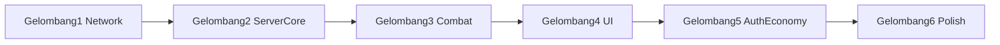

# Proses Implementasi — Zombie Survival (Perbaikan ke Playable)

> **Status:** 🟨 Fondasi ~60% ada di kode; dokumen ini = urutan perbaikan sampai co-op layak dimainkan  
> **Defect inventory:** [Zombie_Survival_Code_Review.md](Zombie_Survival_Code_Review.md) (P0–P3)  
> **Tanggal:** 16 Agustus 2026  
> **Jangan** menganggap fitur “selesai” hanya karena file komponen ada — cek wiring client↔server.

---

## 0. Prinsip Kerja

1. Kerjakan **per gelombang** di bawah; jangan loncat ke polish sebelum P0 hijau.
2. Setiap fix: verifikasi di client **dan** server (message name, state sync, auth).
3. Setelah gelombang selesai, centang ID di Code Review (atau coret di PR).
4. Angka ekonomi/wave: `shared/index.ts` (`ZOMBIE_*`, `WAVE_CONFIG`, `POWER_UPS`).

---

## 1. Peta Gelombang

| Gelombang | Fokus | ID Code Review | Estimasi |
| :---: | :--- | :--- | :--- |
| **1** | Isolasi network zombie | P0-1, P1-10, P2-3 | Tinggi |
| **2** | Boundary, wave, nuke, game over | P0-2, P0-5, P0-6, P0-7 | Tinggi |
| **3** | Combat & pickup | P0-3, P0-4, P1-1 | Sedang |
| **4** | UI progression wiring | P1-2, P1-3, P1-6, P2-14, P2-16 | Sedang |
| **5** | Server-authoritative economy & revive | P1-4, P1-5, P1-7, P1-8, P1-9, P2-4, P2-19 | Tinggi |
| **6** | Perf & polish | P2-6…P2-13, P3-* | Rendah |

---

## 2. Gelombang 1 — Isolasi Network Stack

**Masalah:** `ZombieSurvivalMode` mount `PlayerController` → `useNetwork()` join `fps_room` (hanya skip `training`).

### Langkah

1. **`client/src/hooks/useNetwork.ts`**  
   Skip connect jika `mode === "zombie"` (sama seperti `training`).

2. **Posisi player**  
   - Spawn dari `ZOMBIE_SPAWN.player`, bukan `SPAWN.T`.  
   - Reconcile / baca posisi dari `useZombieNetworkStore.lastSnapshot`, bukan `useNetworkStore`.

3. **Input map** (`ZombieSurvivalMode` InputManager vs PlayerController)  
   - Space: jangan bentrok start-game vs jump (pisah key atau gate fase).  
   - R / F: satu pemilik saja di mode zombie.

4. **Opsional lebih bersih:** `ZombiePlayerController` terpisah (copy minimal movement) agar tidak bawa HUD/death multiplayer.

### Checklist

- [ ] Hanya satu room: `zombie_room`
- [ ] Kamera spawn di Safe House (`z ≈ -40`)
- [ ] Tidak ada traffic ke `fps_room` saat mode zombie

---

## 3. Gelombang 2 — Server Core (Boundary / Wave / Nuke / Game Over)

### Langkah

1. **`ZOMBIE_MAP_BOUNDARY`** di `shared/index.ts` (mis. ±60)  
   Pakai di `ZombieSurvivalRoom` clamp movement — **jangan** `MAP_BOUNDARY` FPS (±19).

2. **`WaveSystem` boss spawn**  
   Track `bossesSpawned` terpisah; bandingkan ke `totalBosses`, bukan `zombiesSpawned < remainingBosses`.

3. **Nuke**  
   Saat nuke: `zombieCtrl.removeZombie(id)` (atau skip mati saat sync state). Jangan hanya `state.zombies.delete`.

4. **Game over**  
   Jika `aliveSurvivors === 0` dan tidak ada downed: pause/reset `waveSystem`; guard `update` saat `phase !== "active"`.

### Checklist

- [ ] Player bisa jalan ke seluruh arena visual
- [ ] Boss wave spawn jumlah boss yang benar
- [ ] Nuke menghapus zombie permanen
- [ ] Setelah game over tidak ada spawn baru

---

## 4. Gelombang 3 — Combat & Pickup

### Langkah

1. **Fire rate client** — di InputManager, throttle `sendShoot` ke `WEAPONS[weapon].fireRate` (bukan tiap frame).

2. **Fire rate server** — `lastShotTime` per player di `handleShoot`; Double Tap = multiplier (siapkan flag, efek penuh di Gelombang 5).

3. **Pickup power-up**  
   - Client: `room.send("pickup_powerup", { id })` (bukan field di `input`).  
   - Pass `playerPosition` dari snapshot ke `PowerUpRenderer` (bukan `{0,0}`).

4. **Points UI** — hapus `addPoints` di handler `zombieKilled`; andalkan `onStateChange` saja (SFX boleh tetap di event).

### Checklist

- [ ] Tembak mengikuti fire rate senjata; ammo tidak habis instan
- [ ] Pickup power-up berhasil dekat drop
- [ ] Points HUD = 1× nilai server

---

## 5. Gelombang 4 — Mount & Wire UI

### Langkah

1. Mount `<MysteryBox />` dan `<PackAPunch />` di `ZombieSurvivalMode` + proximity trigger.
2. `WeaponShop`: case perk → `sendBuyPerk(id)`; beli senjata jangan hanya `switch_weapon`.
3. HUD HP / ammo / armor dari `localHp` / `localAmmo` / `localArmor` zombie store.
4. Hit feedback: listen `zombieHit` atau event setara (HitMarker mode-aware).
5. `ZombieGameOver`: track kills/headshots dari `zombieKilled` (jangan hardcode `0`).
6. `PackAPunch`: complete hanya setelah event server, bukan `setTimeout` client.

### Checklist

- [ ] Mystery Box & PaP bisa dipakai in-game
- [ ] Perk terkirim ke server
- [ ] HUD vital terlihat
- [ ] Score akhir menampilkan kill nyata

---

## 6. Gelombang 5 — Server-Authoritative

### Langkah

1. **Revive co-op** — hold input near downed; server naikkan progress by `dt` (abaikan `progress` client). Broadcast `sessionId` di `playerRevived`.
2. **Weapon ownership** — track owned weapons; `switch_weapon` hanya ke owned; beli = deduct points.
3. **Proximity** — buy ammo/armor/perk, mystery box, PaP, unlock area: cek jarak server (pattern repair barricade).
4. **Armor / Juggernog / Double Tap** — damage pakai armor; max HP 200 dengan Jugg; fire rate × Double Tap.
5. **`resetGame()`** sebelum `handleStartGame` ulang (wave, zombie, points, extraction, players HP).
6. **Barricade repair** — cooldown / 1 board per aksi; blok shoot saat `isDowned`.

### Checklist

- [ ] Tidak bisa beli dari ujung map
- [ ] Tidak bisa switch AK gratis
- [ ] Revive tidak bisa di-skip dengan `progress: 100`
- [ ] Restart run bersih

---

## 7. Gelombang 6 — Perf & Polish

Ikuti daftar P2/P3 di Code Review, prioritas:

1. Throttle A* pathfinding (recalc 0.5–1 s)
2. Kurangi `broadcastSnapshot` redundan
3. Spitter ranged; headshot height check
4. Schema: `mysteryBoxPosition`, `activePowerUp` sentinel
5. `ZombieHealthBar`, limb refs, label shop, leaderboard key, `waveClear` SFX
6. Clear timers on `onLeave`

---

## 8. Smoke Test Manual (setiap gelombang)

| # | Skenario | Harapan |
| :--- | :--- | :--- |
| 1 | Masuk `/zombie` dari menu | 1 koneksi `zombie_room` saja |
| 2 | Space → jalan ke helipad arah | Tidak terjepit di z±19 |
| 3 | Tahan LMB | Fire rate senjata; ammo turun wajar |
| 4 | Kill zombie | Points naik 1×; HUD sync |
| 5 | Dekati power-up | Pickup berhasil |
| 6 | Wave boss | Jumlah boss sesuai config |
| 7 | Mati semua | Game over; tidak spawn terus |
| 8 | Beli ammo/perk di shop | Points berkurang; efek aktif |
| 9 | (Co-op) revive ally | Progress server-side; revive sukses |

---

## 9. File Utama

| Area | Path |
| :--- | :--- |
| Screen | `client/src/screens/ZombieSurvivalMode.tsx` |
| Network | `client/src/stores/useZombieNetworkStore.ts` |
| Store | `client/src/stores/useZombieStore.ts` |
| Room | `server/src/rooms/ZombieSurvivalRoom.ts` |
| Wave | `server/src/systems/WaveSystem.ts` |
| AI | `server/src/ai/ZombieController.ts` |
| Shared | `shared/index.ts` |
| Defects | `docs/Zombie_Survival_Code_Review.md` |

---

## 10. Definition of Done (mode playable)

- [ ] Tidak dual-connect ke `fps_room`
- [ ] Semua P0 di Code Review tertutup
- [ ] P1 kritis (shop, pickup, points, revive, HUD) tertutup
- [ ] Satu run: wave → kill → belanja → (opsional) extract atau game over bersih
- [ ] Checklist Master #76–89 diupdate status realistis (bukan ✅ palsu)
