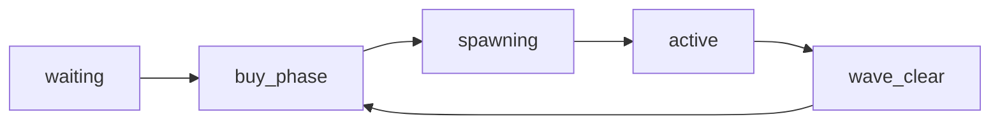

# Zombie Survival Mode — Complete Documentation

## Table of Contents

1. [Overview](#overview)
2. [Game Flow](#game-flow)
3. [Controls & Interactive Hotkeys](#controls--interactive-hotkeys)
4. [Weapons & Wonder Weapons](#weapons--wonder-weapons)
5. [Zombie Types & AI Behaviors](#zombie-types--ai-behaviors)
6. [Wave System & Progression](#wave-system--progression)
7. [Shop & Economy](#shop--economy)
8. [Perks](#perks)
9. [Pack-a-Punch & Elemental Effects](#pack-a-punch--elemental-effects)
10. [Mystery Box](#mystery-box)
11. [Map & 3D Facility Architecture (Outpost Z-7)](#map--3d-facility-architecture-outpost-z-7)
12. [Doorway Barricades & Horde Funneling](#doorway-barricades--horde-funneling)
13. [Extraction System](#extraction-system)
14. [Power-Ups](#power-ups)
15. [Difficulty Levels](#difficulty-levels)
16. [Scoring & Leaderboard](#scoring--leaderboard)
17. [Technical Architecture & Local Simulation Engine](#technical-architecture--local-simulation-engine)

---

## Overview

Zombie Survival Mode is a high-intensity, cooperative PvE and solo survival mode where players fight endless waves of the undead inside the fortified research facility **"Outpost Z-7"**. Between waves, players use points earned in combat to buy firearms, unlock specialized perks, fortify doorway barricades, unlock security sectors, spin the Mystery Box for Wonder Weapons, and upgrade their arsenal at the Pack-a-Punch forge.

**Core Loop:** Fight zombie hordes → Earn combat points → Unlock facility sectors & buy upgrades → Survive special waves & boss encounters → Call helicopter extraction or fight to the last stand.

---

## Game Flow

### 1. Lobby & Difficulty Selection

When entering Zombie Survival, the deployment lobby presents 4 selectable difficulty configurations:

| Difficulty | Multipliers | Solo Revives | Description |
|------------|-------------|--------------|-------------|
| **Casual** | 0.8× HP/damage, 1.25× points | 5 | For beginner training and relaxed exploration. |
| **Normal** | 1.0× HP/speed/damage, 1.0× points | 3 | The standard balanced tactical survival experience. |
| **Hardcore** | 1.15× HP, 1.2× speed, 1.3× damage | 1 | Fast and punishing; tight ammo and resource economy. |
| **Nightmare** | 1.35× HP, 1.3× speed, 1.5× damage | 0 | Ultimate test of skill; no solo self-revives allowed. |

### 2. Spawn & Initial Loadout

- **Spawn Location:** `(0, 0, -30)` inside the fortified Safe House.
- **Starting Equipment:** Deagle pistol (14/70 ammo) + Standard Combat Knife.
- **Initial Bank:** 1000 points (on Normal difficulty).
- **Initial Prep Window:** 20 seconds before Wave 1 begins (press `[SPACE]` to skip).
- **Med Station:** Hold `[F]` for 2.5s in the Safe House (400 pts) to restore HP to max.
- **Wall-buys:** MP5 (Safe House), AK-47 (East Wing), AWP (Watch Tower). Perk machines and ammo crates are also `[F]` interactable.

### 3. Wave Lifecycle State Machine



| State | Duration | Description |
|-------|----------|-------------|
| **waiting** | Idle | Game not yet started or reset after a run. |
| **buy_phase** | 15s (20s on Wave 1) | Free preparation window to buy weapons, perks, armor, heal, and repair boards. Press `[SPACE]` to skip. |
| **spawning** | 10s | Zombies dynamically stream into the facility from unlocked perimeter spawn zones. |
| **active** | Variable | Horde is fully engaged. Players must eliminate all remaining hostiles. |
| **wave_clear** | 4–5s | All hostiles eliminated. Wave completion bonus points are awarded. |

### 4. Game End Conditions

1. **Extraction Victory:** All surviving players reach the Helipad zone `(0, 0, 30)` within the 30-second evacuation timer (+5,000 bonus points).
2. **Team Wipe:** All players are downed or dead simultaneously → Game Over summary screen.
3. **Solo Bleedout:** Downed timer (30s) expires with no solo revives remaining → Game Over.

---

## Controls & Interactive Hotkeys

The HUD features both direct keyboard hotkeys and interactive, clickable HUD badges:

| Key / Control | Action | Functionality |
|---------------|--------|---------------|
| **WASD** | Movement | Walk / strafe through corridors and doorways. |
| **Left Click** | Attack | Fire active weapon / swing knife. |
| **Right Click** | Aim (ADS) | Align iron sights on crosshair for tighter bullet spread. |
| **R** | Reload | Reload active magazine from reserve ammo. |
| **[F]** (Tap) | Contextual Use | Interact with Mystery Box, Pack-a-Punch, Barricades, Door Locks, and Helipad. |
| **[F]** (Hold) | Revive Ally | Hold near a downed teammate (within 3m) to revive them. |
| **[B]** | Weapon Shop | Opens the armory shop UI to purchase weapons, ammo, armor, and perks. |
| **[TAB] / [L]** | Leaderboard | Opens real-time match scoreboard and local high scores. |
| **[SPACE]** | Skip Buy Phase | Instantly ends buy phase / wave clear rest and starts next wave. |
| **1 / 2 / 3** | Weapon Slots | Primary (`1`), Secondary (`2`), Knife Melee (`3`). |
| **Scroll Wheel** | Cycle Weapons | Seamlessly cycle through carried arsenal. |
| **[ESC]** | Menu / Settings | Opens settings, audio volume, and sensitivity configuration. |

---

## Weapons & Wonder Weapons

### Primary Weapons

| Weapon | Type | Damage | Headshot | Fire Rate | Mag | Reload | Reserve | Price |
|--------|------|--------|----------|-----------|-----|--------|---------|-------|
| **AK-47** | Rifle | 35 | 100 | 10.0 rps | 30 | 2.4s | 90 | 1,200 |
| **M4A1** | Rifle | 31 | 92 | 11.0 rps | 25 | 3.1s | 75 | 1,400 |
| **AWP** | Sniper | 115 | 115 | 0.83 rps | 5 | 3.7s | 30 | 2,500 |
| **MP5** | SMG | 24 | 72 | 10.5 rps | 30 | 2.1s | 120 | 800 |

### Wonder Weapons (Mystery Box Exclusive)

| Weapon | Type | Damage | Headshot | Fire Rate | Mag | Reload | Reserve | Special Feature |
|--------|------|--------|----------|-----------|-----|--------|---------|-----------------|
| **Arc Caster** | Wonder Weapon | 40 | 40 | 3.2 rps | 12 | 2.8s | 36 | **Tesla Arc:** Direct hits automatically chain high-voltage lightning to 2 adjacent zombies within 5m dealing 60% damage. |

### Secondary Weapons

| Weapon | Type | Damage | Headshot | Fire Rate | Mag | Reload | Reserve | Price |
|--------|------|--------|----------|-----------|-----|--------|---------|-------|
| **Deagle** | Pistol | 53 | 100 | 3.33 rps | 14 | 2.2s | 70 | 400 |
| **Glock** | Pistol | 22 | 78 | 8.0 rps | 20 | 1.8s | 120 | 200 |
| **Tec-9** | Pistol | 18 | 65 | 12.0 rps | 18 | 1.6s | 90 | 500 |
| **Auto Pistol** | Pistol | 20 | 70 | 9.0 rps | 15 | 1.5s | 90 | 500 |

---

## Zombie Types & AI Behaviors

| Type | Base HP | Speed | Base Damage | Visual Indicator | Unlock Wave | Special Mechanics |
|------|---------|-------|-------------|------------------|-------------|-------------------|
| **Walker** | 100 | 2.5 | 15 | Dark Olive Green | Wave 1 | Standard melee horde infantry. Funnels toward nearest survivor. |
| **Runner** | 60 | 5.0 | 10 | Rust Brown | Wave 3 | Fast sprinter. Quickly closes distances and flanks survivors. |
| **Exploder** | 150 | 1.8 | 60 (AoE) | Glowing Olive-Yellow | Wave 4 | **Priming Kamikaze:** When within 4m of player/barricade, stops and primes for 1.5s (pulsing glow). Detonates for 60 AoE damage unless eliminated first. |
| **Tank** | 400 | 1.5 | 30 | Heavy Slate Gray | Wave 5 | Massive damage sponge. Destroys barricade boards with 30 damage per hit. |
| **Spitter** | 80 | 2.0 | 12 + DOT | Chartreuse Green | Wave 7 | **Ranged Kiting AI:** Maintains 5–11m distance. Spits acid projectile every 2.2s (12 dmg + 3s Acid DOT). Retreats backwards if player closes within 5m. |
| **Boss** | 8,000 | 2.8 | 60 | Crimson & Black Plate | Wave 10+ (Every 5) | **3 Attack Modes:** Leap Dash (range 3–10m), Ground Stomp AoE (range < 2.5m), and Heavy Melee. Summons reinforcements at 75%, 50%, and 25% HP. |

---

## Wave System & Progression

### Wave Composition & Spawn Scaling

The total zombie count per wave scales according to:
$$\text{Zombies} = 6 + (\text{Wave} - 1) \times 4$$

- **HP Scaling:** $\text{Base HP} \times [1 + (\text{Wave} - 1) \times 0.15] \times \text{Difficulty Multiplier}$
- **Speed Scaling:** $\text{Base Speed} \times [1 + (\text{Wave} - 1) \times 0.03] \times \text{Difficulty Multiplier}$

### Type Distribution Table

| Waves | Walker | Runner | Exploder | Tank | Spitter | Boss |
|-------|--------|--------|----------|------|---------|------|
| **1 – 2** | 100% | — | — | — | — | — |
| **3** | 60% | 40% | — | — | — | — |
| **4** | 45% | 40% | 15% | — | — | — |
| **5 – 6** | 30% | 30% | 15% | 25% | — | — |
| **7 – 9** | 20% | 25% | 15% | 25% | 15% | — |
| **10, 15, 20+** | 15% | 20% | 15% | 20% | 15% | 2 + $\lfloor \text{Wave} / 5 \rfloor$ Bosses |

---

## Shop & Economy

### Points Economy Table

| Action / Event | Points Earned |
|----------------|---------------|
| Walker Kill | +50 pts |
| Runner Kill | +75 pts |
| Exploder Kill | +80 pts |
| Tank Kill | +150 pts |
| Spitter Kill | +100 pts |
| Boss Kill | +500 pts |
| Headshot Bonus | +25 pts |
| Knife Kill Bonus | +100 pts |
| Bullet Hit (Assist) | +10 pts |
| Barricade Board Repair | +10 pts |
| Ally Revive | +250 pts |
| Wave Clear Bonus | $500 + (\text{Wave} \times 100)$ pts |
| Extraction Success | +5,000 pts |

---

## Perks

Vending machines are stationed in the Safe House and Armory:

| Perk | Price | Color | Gameplay Effect |
|------|-------|-------|-----------------|
| **Juggernog** | 2,500 pts | Red | Boosts max HP from 100 to 200. Restores 150 HP on revive. |
| **Speed Cola** | 3,000 pts | Green | Cuts all weapon reload times by 50%. |
| **Double Tap** | 2,000 pts | Orange | Increases fire rate by 33% (25% faster cooldown). |
| **Quick Revive** | 1,500 pts | Cyan | Reduces ally revive time from 3.0s to 1.5s. In solo mode, grants +1 extra self-revive. |

---

## Pack-a-Punch & Elemental Effects

**Station Location:** Central Armory Hub `(0, 0, 0)`  
**Price:** 5,000 points  
**Base Upgrades:** 1.5× Damage multiplier, 2× magazine capacity, 2× reserve ammo, and dual-wield akimbo for pistols.

### Active Elemental Combat Effects

| Base Weapon | PaP Variant Name | Elemental Effect | Combat Behavior |
|-------------|------------------|------------------|-----------------|
| **AK-47** | **AK-117 Inferno** | `fire_dot` | Inflicts 3s burning DOT (4 dmg/s) on target; fire spreads to adjacent zombies within 2m. |
| **M4A1** | **M4A4 Hellfire** | `explosive` | Killing a zombie triggers a 40 AoE explosive blast damaging all hostiles within 3m. |
| **AWP** | **AWP Thunderbolt** | `chain_lightning` | Direct hits discharge electrical arcs striking up to 3 adjacent zombies within 6m (-30% dmg per chain). |
| **MP5** | **MP5-K Venom** | `poison_dot` | Applies stackable neurotoxin (2 dmg/s per stack, up to 3 stacks = 6 dmg/s for 4s). |
| **Deagle** | **Deagle Apocalypse** | `pierce` | High-velocity round pierces up to 2 zombies lined up behind the primary target. |
| **Glock** | **Glock Radiance** | `stun` | Shocks and slows affected zombie movement speed by 60% for 2.5 seconds. |
| **Arc Caster** | **Arc Caster Overcharge** | `chain_lightning` | Enhanced Tesla discharge chains to 3 hostiles with 80% cascading damage. |

---

## Mystery Box

**Station Location:** Courtyard `(0, 0, 5)`  
**Standard Price:** 950 points (10 points during Fire Sale power-up)  
**Spin Duration:** 4.0 seconds

### Weapon Probability Weights

| Weapon | Tier | Pool Weight | Approx. Chance |
|--------|------|-------------|----------------|
| **MP5** | SMG | 25 | 24.0% |
| **AK-47** | Rifle | 20 | 19.2% |
| **M4A1** | Rifle | 20 | 19.2% |
| **Glock** | Pistol | 20 | 19.2% |
| **Deagle** | Pistol | 15 | 14.4% |
| **Tec-9** | Pistol | 10 | 9.6% |
| **Auto Pistol** | Pistol | 10 | 9.6% |
| **AWP** | Sniper | 5 | 4.8% |
| **Arc Caster** | Wonder Weapon | 4 | 3.8% |

---

## Map & 3D Facility Architecture (Outpost Z-7)

Outpost Z-7 is structured with 7 distinct physical 3D sectors equipped with Rapier physical colliders, doorways, and verticality:

```
                      [ WATCH TOWER ] (Sniping Platform y:4.8)
                             ▲
                             │ (Stairs)
  [ WEST WING ] ───► [ ARMORY HUB ] ◄─── [ EAST WING ]
(Barracks Loop)        (Pack-a-Punch)      (Cargo Warehouse)
       ▲                     │                    ▲
       │                     ▼                    │
[ SAFE HOUSE ] ◄─────────── [ ] ─────────────────► [ ]
(Spawn & Perks)
       │
       ▼
 [ HELIPAD ] (Extraction z:30)
```

1. **Safe House (`0, -40`):** Concrete fortification with interior warm lighting, perk machines, med station (hold F), MP5 wall-buy, ammo crates, and 2 reinforced doorway exits covered by `barricade_1` and `barricade_2`.
2. **East Wing (`25, -15`):** Industrial shipping container warehouse with stacked cargo crates and tight chokepoints.
3. **West Wing (`-25, -15`):** L-shaped military barracks engineered for zombie train looping and kiting.
4. **Armory Hub (`0, 0`):** Fortified central bunker housing the Pack-a-Punch forge with 3 connecting archways.
5. **Watch Tower (`25, 25`):** 2-story steel observation platform with a walkable 35° staircase ramp, perimeter railings, and elevated sightlines for snipers.
6. **Underground Bunker (`-25, 25`):** Heavy reinforced blast-door bunker with an entrance chokepoint covered by `barricade_6`.
7. **Helipad (`0, 30`):** Elevated landing pad with dynamic status lighting (Red = Locked, Amber = Available, Green = Evacuating).

### Security Sector Unlock Costs

| Sector | Cost | Unlocks Pathway |
|--------|------|-----------------|
| **Safe House** | Free | Starting Sector |
| **East Wing Warehouse** | 750 pts | East corridor to Armory |
| **West Wing Barracks** | 750 pts | West corridor to Armory |
| **Armory Central Hub** | 1,000 pts | Pack-a-Punch Forge |
| **Helipad Access** | 1,250 pts | South evacuation zone |
| **Watch Tower** | 1,500 pts | Elevated high-ground sniper perch |
| **Underground Bunker** | 2,000 pts | High-density fortified fallback point |

---

## Doorway Barricades & Horde Funneling

6 physical barricades are situated directly within facility doorframes to hold back incoming hordes:

| ID | Location | Coordinates | Rotation | Function |
|----|----------|-------------|----------|----------|
| `barricade_1` | Safe House West Door | `x: -15, z: -35` | 0 rad | Seals West Wing entrance |
| `barricade_2` | Safe House East Door | `x: 15, z: -35` | 0 rad | Seals East Wing entrance |
| `barricade_3` | Armory South Archway | `x: 0, z: -10` | 0 rad | Protects Pack-a-Punch hub from South |
| `barricade_4` | Armory East Corridor | `x: 10, z: 0` | 1.57 rad | Corrugated corridor to East Wing |
| `barricade_5` | Armory West Corridor | `x: -10, z: 0` | 1.57 rad | Corrugated corridor to West Wing |
| `barricade_6` | Bunker Stairwell Door | `x: -25, z: 18` | 0 rad | Fortifies single bunker entrance |

- **Capacity:** 6 wooden planks per barricade.
- **Repair Time:** 0.5s per board (+10 points per repair).
- **Zombies:** Must break through boards before entering rooms.

---

## Extraction System

Survivors can call an extraction chopper to escape Outpost Z-7 with high-score bonuses:

- **Automatic Evac Available:** Wave 10+ (Free).
- **Manual Early Evac:** Wave 5+ (Costs 5,000 points).
- **Countdown:** 30 seconds once triggered.
- **Surge Wave:** Continuous spawns of Runners and Tanks during evacuation.
- **Requirement:** All living survivors must stand inside the 12m Helipad circle `(0, 0, 30)` when the timer reaches zero.

---

## Power-Ups

Zombies have a 15% chance to drop floating, glowing power-up emblems on death:

| Power-Up | Duration | Effect |
|----------|----------|--------|
| **Max Ammo** | Instant | Instantly tops off magazines and reserve ammo for all players. |
| **Nuke** | Instant | Detonates across the facility, killing all active zombies and awarding +400 pts. |
| **Insta-Kill** | 30s | All firearm, melee, and elemental hits become lethal 1-shot kills. |
| **Double Points** | 30s | Doubles all point earnings from kills, assists, and barricade repairs. |
| **Carpenter** | Instant | Completely repairs all 6 barricades to full 6/6 boards and awards +200 pts. |
| **Fire Sale** | 30s | Slashes Mystery Box spin cost to 10 points. |

---

## Technical Architecture & Local Simulation Engine

### Monorepo Layering

```
cs-game/
├── shared/                     # Authoritative schemas, WEAPONS, ZOMBIE_TYPES, PAP_WEAPON_VARIANTS
├── server/
│   ├── src/rooms/
│   │   └── ZombieSurvivalRoom.ts # Authoritative Colyseus room (multiplayer ticks & DOT engine)
│   └── src/ai/
│       ├── ZombieController.ts   # Spitter kiting, Exploder priming, Boss attack state machine
│       └── Pathfinder.ts         # A* NavMesh traversal
└── client/
    └── src/
        ├── game/zombie/
        │   ├── LocalZombieEngine.ts # Full offline singleplayer physics & wave simulation
        │   └── ZombieRenderer.tsx   # 3D procedural animated zombie models with priming glows
        ├── game/map/
        │   ├── ZombieArena.tsx       # 7 physical 3D facility zones with Rapier colliders
        │   └── InteractiveBarricades.tsx # 3D wooden board rendering
        └── game/weapons/
            ├── WeaponModel.tsx       # 3D viewmodels including Arc Caster Tesla weapon
            └── weaponRig.ts          # ADS, akimbo offsets, and muzzle alignments
```

### Local Simulation Engine (`LocalZombieEngine.ts`)

When playing offline or in singleplayer mode, the client runs `LocalZombieEngine.ts`:
- **60 FPS Simulation:** Updates wave timers, zombie pathing, Spitter kiting, and Exploder priming locally.
- **Damage & Elemental Engine:** Simulates fire burn spreading, poison stacking, chain lightning hops, and explosive kill splash directly in memory.
- **Store Sync:** Automatically mirrors local state into `useZombieStore` and `useZombieNetworkStore` so all HUDs, minimaps, and weapon shops function identically to multiplayer mode.
