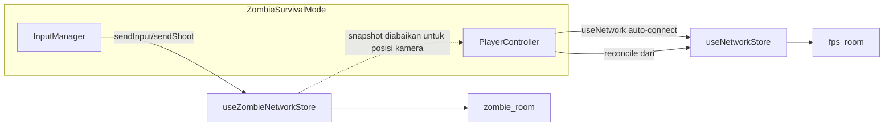

# Code Review — Zombie Survival Mode

> **Tanggal review:** 16 Agustus 2026  
> **Scope:** Perubahan uncommitted client / server / shared untuk mode Zombie Survival  
> **Metode:** Defect-first, hanya temuan dengan bukti di kode  
> **Dokumen terkait:** [Impl_Zombie_Survival.md](Impl_Zombie_Survival.md) (proses perbaikan)

---

## 1. Ringkasan Eksekutif

Fondasi mode Zombie Survival (~60% maturity) sudah ada: `zombie_room`, wave system, AI dasar, economy schema, arena 3D, dan HUD partial. **Bukan feature-complete.** Banyak klaim “Selesai” di plan transformasi tidak sesuai kode aktual (UI tidak di-mount, protokol client–server mismatch, player stack masih terhubung ke multiplayer FPS).

Status realistis: **demo lokal dengan workaround** — belum siap multiplayer co-op serius.

### Masalah arsitektur utama

---

## 2. Matriks Status Modul (Koreksi)

| No | Modul | Klaim plan lama | Status aktual | Catatan |
| :--- | :--- | :---: | :---: | :--- |
| 1 | Room & game mode | Selesai | 🟨 Parsial | `zombie_room` OK; dual-connect ke `fps_room` via `PlayerController` |
| 2 | Zombie state & schema | Selesai | 🟨 Parsial | Schema ada; beberapa field schema mismatch (`mysteryBoxPosition`, `activePowerUp`) |
| 3 | Zombie AI & pathfinding | Selesai | 🟨 Parsial | Follow + A* ada; Spitter tanpa ranged; A* setiap tick berat |
| 4 | Wave system | Selesai | 🟨 Bug | Boss spawn bertahap rusak; game over tidak pause wave |
| 5 | Point & economy | Selesai | 🟨 Bug | Server deduct OK; UI double-count; shop tanpa proximity |
| 6 | Weapon shop | Selesai | 🟨 Parsial | Ammo/armor wired; perk tidak terkirim; senjata gratis via `switch_weapon` |
| 7 | Mystery Box | Selesai | 🔲 Tidak wired | Komponen ada, **tidak di-mount** di screen |
| 8 | Pack-a-Punch | Selesai | 🔲 Tidak wired | Komponen ada, **tidak di-mount**; success dari timer client |
| 9 | Area unlock | Selesai | 🟨 Parsial | UI/server tanpa proximity; `unlockedAreas` tidak sync dari state |
| 10 | Power-ups | Selesai | 🔴 Rusak | Protokol pickup mismatch; posisi player hardcoded `(0,0)`; nuke re-sync bug |
| 11 | Outpost Z-7 map | Selesai | ✅ OK | Arena visual berfungsi |
| 12 | Zombie 3D render | Selesai | 🟨 Parsial | Mesh OK; health bar stub; limb anim refs tidak terpasang |
| 13 | HUD & UI | Selesai | 🟨 Parsial | Wave/points/evac OK; tidak ada HP/ammo HUD; DeathScreen multiplayer |
| 14 | Procedural SFX | Selesai | 🟨 Parsial | Library ada; `waveClear` tidak dipanggil |
| 15 | Leaderboard | Selesai | 🟨 Parsial | Storage OK; tidak ada cara buka UI in-game |
| 16 | Downed & revive | Selesai | 🟨 Parsial | Solo Quick Revive server OK; co-op revive tidak di-wire; tick trust client |
| 17 | Extraction | Selesai | 🟨 Parsial | Flow ada; tidak pause wave; proximity/unlock tidak divalidasi server |
| 18 | Barricade repair | Selesai | 🟨 Parsial | Visual + message OK; spam points; zombie attack barricade masih damage player |
| 19 | PaP weapon variants | Selesai | 🟨 Server only | Konstanta + server ada; UI PaP tidak mounted |

**Legenda:** ✅ OK · 🟨 Parsial/bug · 🔲 Tidak wired · 🔴 Rusak

---

## 3. Temuan P0 — Release Blocker / Gameplay Rusak

### [P0-1] Dual network stack — zombie mode ikut join `fps_room`

**File:** `client/src/hooks/useNetwork.ts`, `client/src/screens/ZombieSurvivalMode.tsx`, `client/src/game/player/PlayerController.tsx`

`ZombieSurvivalMode` mount `PlayerController`, yang memakai `useNetwork()`. Hook itu hanya skip connect untuk `training`, bukan `zombie` — sehingga client join **dua room** sekaligus. Movement/reconciliation mengacu `useNetworkStore`, bukan `useZombieNetworkStore`.

**Dampak:** Desync posisi, traffic ganda, perilaku tidak terduga antar mode.

**Arah fix:** Guard `mode === "zombie"` di `useNetwork` / `PlayerController`, atau buat controller khusus zombie; jangan mount stack multiplayer di zombie screen.

---

### [P0-2] `MAP_BOUNDARY` FPS menjepit spawn zombie

**File:** `server/src/rooms/ZombieSurvivalRoom.ts`, `shared/index.ts`

Player spawn di `ZOMBIE_SPAWN.player` (`z: -40`), arena client ~±60, tapi movement di-clamp ke `MAP_BOUNDARY` Container Yard (`minZ/maxZ: ±19`).

**Dampak:** Player langsung terjepit ke boundary map FPS; area Safe House tidak reachable di sisi server.

**Arah fix:** Konstanta `ZOMBIE_MAP_BOUNDARY` (mis. ±60) terpisah dari `MAP_BOUNDARY`.

---

### [P0-3] Shoot tanpa fire-rate (client + server)

**File:** `client/src/screens/ZombieSurvivalMode.tsx` (InputManager `useFrame`), `server/src/rooms/ZombieSurvivalRoom.ts` (`handleShoot`)

Client memanggil `sendShoot` **setiap frame** saat mouse down. Server hanya cek ammo, tidak enforce fire rate senjata.

**Dampak:** Magazine habis dalam &lt;1 detik; di sisi cheat, DPS = tick rate × damage.

**Arah fix:** Throttle client ke `WEAPONS[weapon].fireRate`; track `lastShotTime` di server (Double Tap = multiplier).

---

### [P0-4] Protokol pickup power-up tidak cocok

**File:** `client/src/screens/ZombieSurvivalMode.tsx`, `client/src/stores/useZombieNetworkStore.ts`, `server/src/rooms/ZombieSurvivalRoom.ts`

- Client: `sendInput({ pickup_powerup: id })` — field di message `input`
- Server: `onMessage("pickup_powerup", ...)` — message terpisah; `handleInput` mengabaikan field tersebut
- `PowerUpRenderer` mendapat `playerPosition={{ x: 0, z: 0 }}`

**Dampak:** Pickup hampir tidak pernah berhasil.

**Arah fix:** `room.send("pickup_powerup", { id })` + posisi dari `lastSnapshot` / local player.

---

### [P0-5] Boss spawn bertahap gagal

**File:** `server/src/systems/WaveSystem.ts`

`spawnBatch()` memakai `bossCount` sebagai threshold `zombiesSpawned < bossCount`. Saat dipanggil dari `update()`, yang dikirim adalah `remainingBosses`, bukan total boss — sisa boss tidak spawn.

**Contoh:** Total 3 boss, `zombiesSpawned = 5`, `remainingBosses = 1` → `5 < 1` false → boss ke-3 hilang.

**Arah fix:** Track `bossesSpawned` terpisah; bandingkan dengan `totalBosses`.

---

### [P0-6] Nuke tidak menghapus zombie dari controller

**File:** `server/src/rooms/ZombieSurvivalRoom.ts`

Nuke set `isDead` + `state.zombies.delete`, tapi tidak `zombieCtrl.removeZombie()`. Tick berikutnya re-sync semua zombie dari controller → zombie “hidup” lagi di state.

**Arah fix:** Panggil `removeZombie` / skip zombie mati saat sync; bersihkan map controller.

---

### [P0-7] Game over tidak menghentikan wave system

**File:** `server/src/rooms/ZombieSurvivalRoom.ts`

Saat semua survivor mati: `phase = "waiting"` + broadcast `gameOver`, tapi `waveSystem.update(dt)` tetap jalan.

**Dampak:** Spawn zombie lanjut di background setelah game over.

**Arah fix:** Pause/reset `WaveSystem` on game over; guard spawn saat `phase !== "active"`.

---

## 4. Temuan P1 — Urgent

### [P1-1] Points UI double-count

**File:** `client/src/stores/useZombieNetworkStore.ts`, `client/src/stores/useZombieStore.ts`

`onStateChange` sudah set `points` dari server; handler `zombieKilled` memanggil `addPoints(data.points)` lagi.

**Dampak:** Display 2×; affordability shop client salah.

**Arah fix:** Hapus `addPoints` di event handler; andalkan state server (SFX tetap boleh di handler).

---

### [P1-2] Weapon shop — perk & pembelian senjata rusak

**File:** `client/src/ui/components/zombie/WeaponShop.tsx`, `server/src/rooms/ZombieSurvivalRoom.ts`

- Case `"perk"`: tidak memanggil `sendBuyPerk()`
- Senjata: `sendSwitchWeapon()` — server `handleSwitchWeapon` hanya set `currentWeapon`, tanpa deduct points / cek ownership
- Client `Digit2` bisa langsung switch ke `"ak47"` gratis

**Arah fix:** Wire `sendBuyPerk`; track owned weapons; beli senjata = deduct points + ownership check.

---

### [P1-3] Mystery Box & Pack-a-Punch tidak di-mount

**File:** `client/src/screens/ZombieSurvivalMode.tsx`

Handler network (`sendMysteryBox`, `sendPackAPunch`, event spin) ada, tapi screen **tidak render** `<MysteryBox />` / `<PackAPunch />`.

**Arah fix:** Mount + trigger proximity di arena.

---

### [P1-4] Co-op revive tidak wired + server trust client progress

**File:** `client/src/stores/useZombieNetworkStore.ts`, `client/src/components/DownedOverlay.tsx`, `server/src/rooms/ZombieSurvivalRoom.ts`

- `sendStartRevive` / `sendTickRevive` / `sendCancelRevive` tidak dipanggil dari UI/input
- `handleTickRevive` menerima `progress` dari client tanpa validasi waktu → client bisa kirim `progress: 100`

**Arah fix:** Hold `[E]` near downed + server increment progress by `dt` (abaikan nilai client).

---

### [P1-5] `playerRevived` kirim nickname, bukan sessionId

**File:** `server/src/rooms/ZombieSurvivalRoom.ts`

Broadcast memakai `target.nickname` / `reviver.nickname`; client expect session ID (konsisten dengan `playerDowned`).

**Arah fix:** Kirim `sessionId` di semua event revive.

---

### [P1-6] Tidak ada HUD HP / ammo / armor zombie

**File:** `client/src/stores/useZombieNetworkStore.ts`, `client/src/screens/ZombieSurvivalMode.tsx`

`localHp`, `localAmmo`, `localArmor` di-update dari server tapi tidak ditampilkan. `DeathScreen` / `HitMarker` / `DamageVignette` baca `useNetworkStore` (multiplayer). Event `zombieHit` tidak punya listener.

**Arah fix:** Zombie HUD (pattern `HUDLayout`); mode-aware feedback components.

---

### [P1-7] Armor, Juggernog, Double Tap tidak berefek di combat

**File:** `server/src/rooms/ZombieSurvivalRoom.ts`

Damage zombie langsung ke `hp`; `armor` / `hasJuggernog` tidak dipakai. `hasDoubleTap` diset saat beli tapi `handleShoot` tidak ubah fire rate.

**Arah fix:** Armor absorption; max HP 200 dengan Juggernog; fire-rate multiplier Double Tap.

---

### [P1-8] Restart game tidak reset state

**File:** `server/src/rooms/ZombieSurvivalRoom.ts` (`handleStartGame`)

Hanya set `phase = "active"` + `startFirstWave()` — tidak reset wave counter, zombie, points, players, extraction.

**Arah fix:** Method `resetGame()` lengkap sebelum start ulang.

---

### [P1-9] Shop / unlock / PaP / mystery box tanpa proximity server

**File:** `server/src/rooms/ZombieSurvivalRoom.ts`

Pembelian & unlock hanya cek points; bisa dipanggil dari mana saja di map.

**Arah fix:** Validasi jarak ke station/area (pattern `handleRepairBarricade`).

---

### [P1-10] Posisi visual player tidak dari snapshot zombie

**File:** `client/src/game/player/PlayerController.tsx`, `client/src/stores/useZombieNetworkStore.ts`

Spawn default `SPAWN.T`, bukan `ZOMBIE_SPAWN.player`. Snapshot zombie hanya dipakai untuk prompt jarak HUD, bukan reconcile kamera.

**Arah fix:** Spawn + reconcile dari zombie network state.

---

## 5. Temuan P2 — Defect Biasa

| ID | Masalah | File | Arah fix |
| :--- | :--- | :--- | :--- |
| P2-1 | Snapshot response per-input flat `{x,y,z}` vs handler expect `data.players[sessionId]` | `useZombieNetworkStore.ts` | Handle kedua format / unify server |
| P2-2 | `unlockedAreas` tidak dibaca dari Colyseus state (hanya event `areaUnlocked`) | `useZombieNetworkStore.ts` | Sync dari `state.unlockedAreas` di `onStateChange` |
| P2-3 | Konflik input: Space (start + jump), F (spam repair), R (reload ganda) | `ZombieSurvivalMode.tsx`, `PlayerController` | Mode-aware input map |
| P2-4 | Barricade repair spam points (no cooldown / channel time) | `ZombieSurvivalRoom.ts` | Cooldown / 1 board per aksi penuh |
| P2-5 | Zombie attack barricade set `isAttacking` → loop damage player nearby | `ZombieController.ts`, room | Flag terpisah barricade vs player |
| P2-6 | Spitter identik walker — tidak ada ranged attack | `ZombieController.ts` | Implement spit / projectile |
| P2-7 | Headshot selalu `false`; bonus headshot unused | `ZombieSurvivalRoom.ts` | Hitscan height check |
| P2-8 | A* pathfinding setiap tick × N zombie | `ZombieController.ts`, `Pathfinder.ts` | Recalc 0.5–1s / flow field |
| P2-9 | `broadcastSnapshot()` 30 Hz redundan dengan schema sync | `ZombieSurvivalRoom.ts` | Snapshot hanya untuk seq reconcile |
| P2-10 | Extraction tidak pause wave; server tidak cek unlock/proximity helipad | `ZombieSurvivalRoom.ts` | Pause wave + validasi server |
| P2-11 | Timer/interval reload & mystery box tidak di-clear on leave | `ZombieSurvivalRoom.ts` | Track + clear di `onLeave`/`onDispose` |
| P2-12 | `mysteryBoxPosition` tidak di `defineTypes`; `activePowerUp = null` vs type string | `shared/index.ts` | Tambah schema / sentinel `""` |
| P2-13 | Helipad radius 12 vs 14 inkonsisten | `EXTRACTION_CONFIG`, screen, `ExtractionHUD` | Satu konstanta shared |
| P2-14 | `ZombieGameOver` kills/headshots hardcoded `0`; `onZombieKilled` WaveSystem tidak dipanggil | screen, `WaveSystem.ts` | Track kill stats |
| P2-15 | Connect effect missing deps & no disconnect on unmount | `ZombieSurvivalMode.tsx` | Cleanup `disconnect()` |
| P2-16 | PackAPunch success dari `setTimeout` client, bukan event server | `PackAPunch.tsx` | Listen `packAPunchComplete` |
| P2-17 | `WAVE_CONFIG.spawnPoints` tidak dipakai; spawn pakai `ZOMBIE_SPAWN` | `shared/index.ts` | Satu sumber spawn points |
| P2-18 | Barricade `hitsPerBoard: 2` vs HP 100 + damage 15/30 | shared + server | Samakan model damage |
| P2-19 | Shoot saat `isDowned` tidak diblokir | `ZombieSurvivalRoom.ts` | Guard `isDowned` |
| P2-20 | `handleStartGame` — siapa saja bisa start (no host/ready) | room | Host / majority ready |

---

## 6. Temuan P3 — Low Impact

| ID | Masalah | File | Arah fix |
| :--- | :--- | :--- | :--- |
| P3-1 | `ZombieHealthBar` return `null` selalu; tidak di-import | `ZombieHealthBar.tsx` | Implement bar + pakai di renderer |
| P3-2 | Limb refs dideklarasikan tapi tidak di-assign ke mesh | `ZombieRenderer.tsx` | Pasang ref ke `ZombieMesh` |
| P3-3 | Header WeaponShop label “MYSTERY BOX” | `WeaponShop.tsx` | Ubah label |
| P3-4 | `zombieSounds.waveClear()` tidak pernah dipanggil | `zombieSounds.ts`, network store | Trigger pada `wave_clear` |
| P3-5 | Leaderboard tidak bisa dibuka (no key/button) | `ZombieSurvivalMode.tsx` | Bind key / tombol |
| P3-6 | `sendInput` / `sendShoot` typed `any` | `useZombieNetworkStore.ts` | Shared input types |
| P3-7 | Chat handler server ada, client zombie tidak kirim chat | `ZombieSurvivalRoom.ts` | Hapus atau wire UI |
| P3-8 | `reviveTargetName` menampilkan session ID | network store | Resolve nickname |
| P3-9 | `InteractiveBarricades` pass prop `id` yang tidak dideclare | `InteractiveBarricades.tsx` | Hapus / declare prop |
| P3-10 | Leaderboard localStorage trivially forgeable | `zombieLeaderboard.ts` | Expected untuk local; dokumentasikan |
| P3-11 | `ServerPredictionManager` dimodifikasi tapi tidak dipakai zombie | prediction manager | Integrate atau jangan sentuh |
| P3-12 | `WaveState` type `'inter_wave'` tidak pernah dipakai | `shared/index.ts` | Hapus atau gunakan |
| P3-13 | `useGameStore.setMode('zombie')` tidak clear session multiplayer | `useGameStore.ts` | Clear session saat switch mode |

---

## 7. Yang Sudah Berfungsi (dengan caveat)

1. Routing `/zombie` ↔ `mode: 'zombie'`; tombol Main Menu
2. Join `zombie_room` + reconnect token sessionStorage
3. Sync wave / zombies / barricades / power-ups / extraction flags via `onStateChange`
4. Render zombie hidup + arena + barricade boards visual
5. HUD: WaveHUD, PointsDisplay, ExtractionHUD, BossWaveWarning, ActivePowerUpIndicator
6. Interaksi partial: repair barricade, trigger extraction (message type benar)
7. Shop partial: `sendBuyAmmo`, `sendBuyArmor` + SFX feedback
8. Game over flow: delay → `ZombieGameOver` → disconnect on menu
9. Shared constants `ZOMBIE_*`, `BARRICADE_CONFIG`, `POWER_UPS` konsisten dipakai

---

## 8. Prioritas Perbaikan (Urutan Kerja)

| Gelombang | Fokus | Item terkait |
| :---: | :--- | :--- |
| **1** | Isolasi network stack zombie | P0-1, P1-10, P2-3 |
| **2** | Boundary, boss spawn, game over, nuke | P0-2, P0-5, P0-6, P0-7 |
| **3** | Combat & pickup dasar | P0-3, P0-4, P1-1 |
| **4** | Mount & wire UI progression | P1-2, P1-3, P1-6, P2-14, P2-16 |
| **5** | Server-authoritative economy & revive | P1-4, P1-5, P1-7, P1-8, P1-9, P2-4, P2-19 |
| **6** | Perf & polish | P2-8, P2-9, P2-6, P2-7, P3-* |

---

## 9. Gap Test

Tidak ditemukan test otomatis khusus untuk:

- `ZombieSurvivalRoom` (join, shoot, economy, revive, extraction)
- `WaveSystem` (boss spawn, inter-wave, game-over pause)
- `ZombieController` / `Pathfinder`
- Protokol client–server message names (`pickup_powerup`, revive, shop)

**Rekomendasi:** Minimal unit test WaveSystem boss spawn + integration smoke test join → shoot → kill → points (tanpa double-count).

---

## 10. Referensi File Utama

| Area | Path |
| :--- | :--- |
| Screen | `client/src/screens/ZombieSurvivalMode.tsx` |
| Network client | `client/src/stores/useZombieNetworkStore.ts` |
| Local store | `client/src/stores/useZombieStore.ts` |
| Room server | `server/src/rooms/ZombieSurvivalRoom.ts` |
| Wave | `server/src/systems/WaveSystem.ts` |
| AI | `server/src/ai/ZombieController.ts`, `Pathfinder.ts` |
| Shared | `shared/index.ts` |
| Defects / proses | `docs/Zombie_Survival_Code_Review.md`, `docs/Impl_Zombie_Survival.md` |
